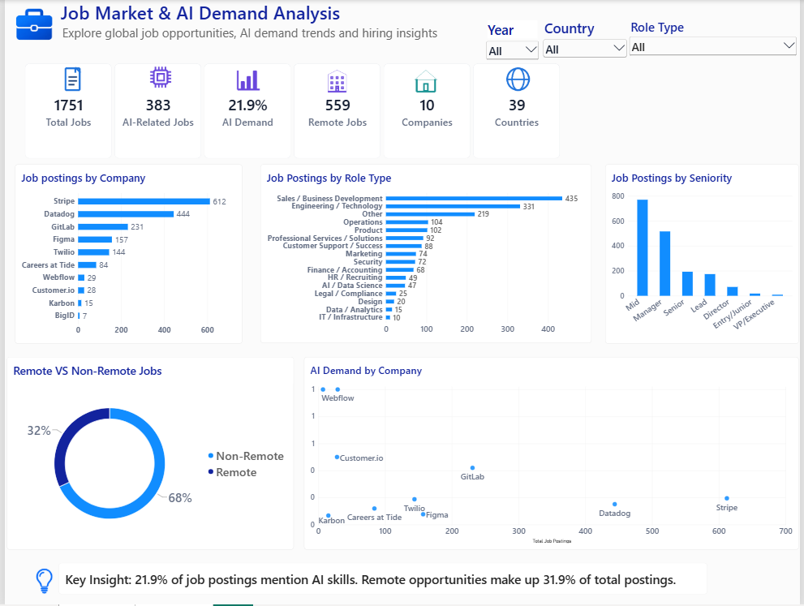
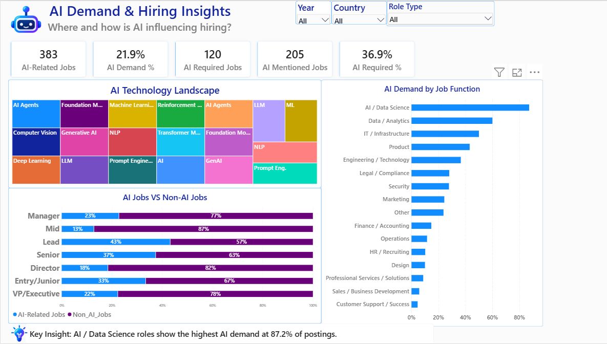

# Job Market & AI Demand Analysis

An end-to-end data analytics project analyzing **1,751 real-world job postings collected through web scraping** to understand hiring trends, AI demand, job functions, seniority levels, remote work, and AI technologies.

## Project Overview

This project follows a complete data analytics workflow — from **web scraping job postings** to data preparation, SQL analysis, and interactive Power BI visualization.

Job postings were collected from multiple companies using their publicly available job-board data. The collected data was cleaned and structured before being analyzed using **SQL** and visualized through **Power BI**.

The analysis focuses on understanding how AI is influencing the modern job market, including:
- AI-related hiring demand
- AI requirements across job functions
- AI demand by seniority
- AI technology trends
- Remote vs. non-remote opportunities
- Geographic differences in AI hiring demand

## Key Findings

The analysis revealed several important patterns in AI-driven hiring:

- **21.9% of job postings** in the dataset mention AI-related skills.
- **36.9% of AI-mentioned jobs** require AI skills or assign AI-related responsibilities.
- **AI / Data Science roles** show the highest AI demand among the analyzed job functions.
- **LLMs, Artificial Intelligence, Machine Learning, and AI Agents** are among the most frequently mentioned AI technologies.
- **Remote roles account for approximately 32%** of all analyzed job postings.
- AI demand varies considerably across **companies, job functions, seniority levels, and countries**, highlighting differences in how organizations and markets are adopting AI-related skills.

## Data Collection

The dataset was collected through **web scraping of publicly available job-board data** from multiple companies.

The collection process captured job-level information such as:

- Job title
- Company
- Location
- Country
- Remote / non-remote status
- Published and updated dates
- Job description
- Job URL

The final dataset contains **1,751 job postings across 10 companies and 39 countries**.

The collected data was then cleaned, standardized, and enriched with additional analytical fields such as:

- Role type
- Seniority level
- AI relevance
- AI keywords
- AI categories
- AI sentence count
- Description length

This prepared dataset was used for the SQL analysis and Power BI dashboards.

## Tools & Technologies

- **Data Collection:** Python-based web scraping
- **Database:** MySQL
- **Data Analysis:** SQL
- **Data Visualization:** Power BI
- **Development Environment:** Jupyter Notebook, VS Code
- **Version Control:** Git & GitHub

## Project Structure

```text
AI_JOB_ANALYSIS/
│
├── Code/
│   ├── web_scraper.py
│   ├── main_cleaned.ipynb
│   └── main_cleaned_AI_Job_Analysis.ipynb
│
├── SQL/
│   └── SQL_ANALYSIS.sql
│
├── Data/
│   ├── final_jobs.csv
│   └── final_jobs_import_utf8_v3.sql
│
├── PowerBI/
│   └── AI_Analytics_Dashboard_P1.pbix
│
├── Dashboards/
│
├── Documentation/
│
├── README.md
├── .gitignore
```

## SQL Analysis

MySQL was used to analyze the job-posting dataset and answer business-focused questions around hiring demand and AI adoption.

Key areas analyzed include:

- Job postings by company and role type
- AI demand across companies
- AI demand by job function
- AI demand by seniority level
- Remote vs. non-remote AI hiring
- AI technology/category frequency
- Variety of AI technologies used across companies
- Geographic differences in AI demand
- AI requirement intensity across job functions

The complete analysis is available in:

`SQL/SQL_ANALYSIS.sql`

## Power BI Dashboard

The analyzed data was transformed into an interactive Power BI dashboard designed to provide a clear view of job-market trends and AI hiring demand.

### Page 1 — Job Market & AI Demand Analysis

Provides an overall view of:

- Total job postings
- AI-related job postings
- AI demand percentage
- Remote job opportunities
- Company and country coverage
- Job postings by company
- Job postings by role type
- Job postings by seniority
- Remote vs. non-remote hiring

### Page 2 — AI Demand & Hiring Insights

Provides a deeper analysis of:

- AI technology landscape
- AI demand by job function
- AI vs. non-AI jobs by seniority
- AI-required vs. AI-mentioned roles
- Dynamic hiring insights based on selected filters

The dashboard includes interactive filters for **Year, Country, Company, and Role Type**.

## Methodology

The project follows a structured analytics workflow:

1. **Data Collection**  
   Job postings were collected from publicly available job-board data using a Python-based web scraper.

2. **Data Cleaning & Preparation**  
   Job titles, locations, dates, descriptions, and other fields were standardized. Additional analytical attributes such as role type, seniority, AI relevance, and AI categories were derived.

3. **Database Loading**  
   The prepared dataset was loaded into a MySQL database for structured analysis.

4. **SQL Analysis**  
   Business questions were analyzed using SQL, including AI demand, hiring patterns, geographic trends, seniority, and AI technology adoption.

5. **Power BI Visualization**  
   The analysis was transformed into interactive dashboards with KPIs, charts, slicers, and dynamic insights.

6. **GitHub Documentation**  
   The code, SQL analysis, dataset, Power BI dashboard, and supporting documentation are organized into a reproducible project structure.

## Repository Contents

| Folder / File | Description |
|---|---|
| `Code/` | Web scraping and data preparation notebooks |
| `SQL/` | MySQL analysis queries |
| `Data/` | Final dataset and MySQL import file |
| `PowerBI/` | Power BI dashboard file |
| `Dashboards/` | Dashboard screenshots |
| `Documentation/` | Supporting project documentation |
| `.gitignore` | Files excluded from version control |

## Dashboard Preview

### Page 1 — Job Market & AI Demand Analysis



### Page 2 — AI Demand & Hiring Insights



